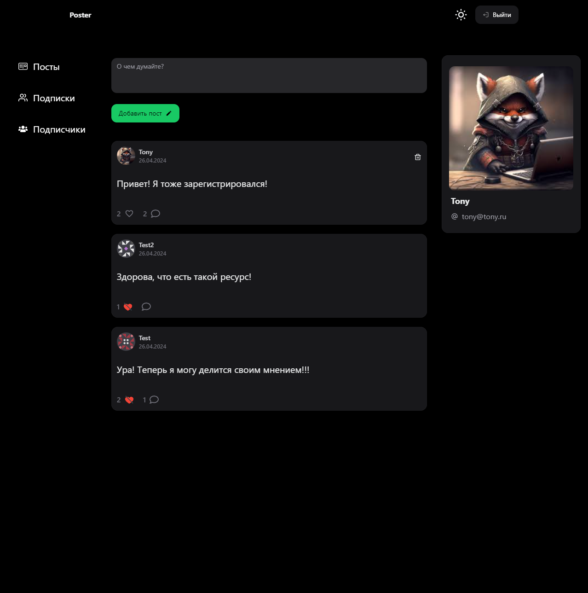

<br clear="both">

<h1>🔥 Пет проект "Poster": Социальная сеть для публикации постов</h1>
<h3>⚡ Клиентская часть приложения</h3>
<br clear="both">
<div align="center">
  
</div>


<h3>🛠 Технологии:</h3>
<ul>
  <li>React</li>
  <li>Typescript</li>
  <li>Redux Toolkit</li>
  <li>React Hook Form</li>
  <li>Next UI</li>
</ul>

<h3>🔥 Описание проекта:</h3>
<p>В приложении доступны следующие функции:</p>
<ul>
  <li>Создание постов: пользователи могут публиковать свои мысли</li>
  <li>Взаимодействие с контентом: возможность комментировать и лайкать посты других пользователей.</li>
  <li>Подписки: подписка на интересных пользователей и возможность отписаться от них в любое время.</li>
  <li>Профили: у каждого пользователя есть личный профиль, где можно редактировать информацию о себе.</li>
  <li>Лента новостей: отображение постов пользователей, на которых подписан пользователь.</li>
</ul>
<br clear="both">

## Для запуска проекта, необходимо выполнить следующие шаги:

1. Склонировать репозиторий с клиентским приложением по ссылке https://github.com/arshtnkv/poster-react.git на свой компьютер.
```
git clone https://github.com/arshtnkv/poster-react.git
```

2. Склонировать репозиторий с api по ссылке [https://github.com/brian7346/express-threads-api.git](https://github.com/brian7346/express-threads-api/tree/main) на свой компьютер.
```
git clone https://github.com/brian7346/poster-express.git
```

3. Открыть терминал (или командную строку) и перейти в корневую директорию сервера.
```
cd poster-express-api
```

4. Переименовать файл .env.local (убрать .local)
```
.env
```

5. Запустить команду docker compose которая поднимет сервер, клиент и базу данных
```
docker compose up
```

6. Открыть браузер и перейти по адресу http://localhost:80, чтобы увидеть запущенный проект.
